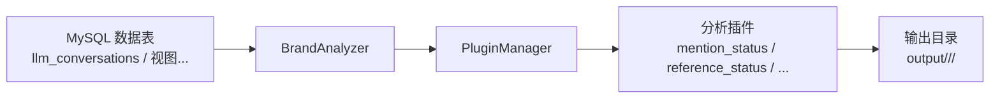
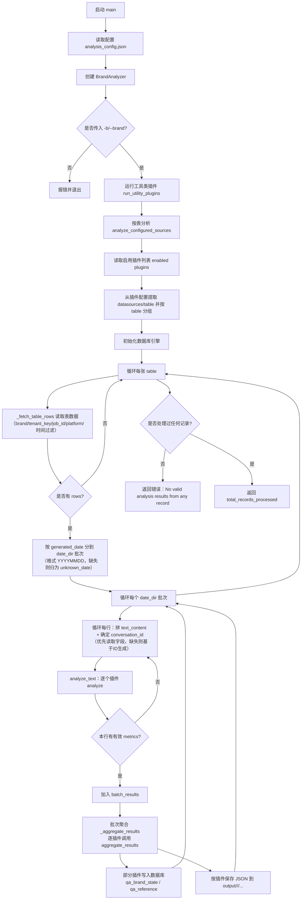

# 品牌AI认知分析工具

一个插件化的品牌AI认知分析工具，基于 LLM 对问答文本进行多维度分析，包括品牌提及、情绪分析、来源提取等。

## 功能特性

- **插件化架构**：每个分析维度作为独立插件，易于扩展
- **配置化驱动**：通过JSON配置文件全权控制分析流程
- **多维度分析**：
  - **Mention Status**：识别文本中的品牌提及状态及首位提及
  - **Reference Status**：识别引用链接是否已发布，并判断内容类型
  - **Extract Source**：基于 LLM 的 URL 来源识别（可降级到域名提取）
  - **LLM Ping**：LLM 服务连通性检测
  - **Import Mention Data**：从指定目录导入 mention_status 结果到数据库
- **多源数据支持**：支持按插件配置多个 MySQL 数据表作为数据源
- **智能输出**：分析结果自动按「插件 + 日期」分目录保存

## 典型使用场景

- **品牌监测**：定期批量分析对话/评论，监控品牌提及和情绪波动
- **竞品对比**：配置多个品牌，比较提及率、情绪和比较优势描述
- **内容评估**：评估营销稿、新闻稿、评论等内容对目标品牌的整体调性
- **舆情回溯**：按日期目录组织数据，复盘某一时间段的品牌舆情情况

## 架构总览

工具由「分析器 + 插件系统 + 统一 LLM 层」组成：



- `BrandAnalyzer` 读取配置文件并加载启用的插件（`src/analyzer.py`），并将全局配置与插件专属配置注入到插件实例中
- `BrandAnalyzer` 按插件配置的 `datasources/table` 从 MySQL 拉取数据，按 `generated_date` 分组为 `YYYYMMDD`（缺失则归档到 `unknown_date`）
- 插件按需调用统一的 `LLMOperator` 与各家 LLM 服务交互（`src/core/llm_operator.py`）
- 分析结果按「插件 + 日期」写入到 `output/<plugin_name>/<YYYYMMDD>/` 目录，且部分插件（如 `mention_status`, `reference_status`）会将结果同步写入 MySQL 表（`qa_brand_state`, `qa_reference`）

## 安装

### 环境要求

- Python 3.8+
- 推荐在虚拟环境中安装（如 `venv` 或 `conda`）

### 安装依赖

```bash
pip install -r requirements.txt
```

## 使用方法

工具主要通过配置文件驱动，只需指定品牌名称和配置文件路径即可。

### 1. 配置分析参数

确保 `config/analysis_config.json` 文件存在并正确配置了：

- MySQL 连接参数占位符（`database.host/user/password/name` 等）
- 要启用的插件及其 `datasources/table` / `output` 路径
- LLM 相关参数（`provider`、`apiKey`、`baseURL`、`model` 等）
- 阈值和输出格式等通用设置

数据库真实连接信息不写入版本化配置。`config/analysis_config.json` 默认使用环境变量占位符，本地可参考 `.env.example` 配置：

- `ANALYSIS_DB_HOST` -> `database.host`，默认 `127.0.0.1`
- `ANALYSIS_DB_PORT` -> `database.port`，默认 `3306`
- `ANALYSIS_DB_USER` -> `database.user`，默认 `root`
- `ANALYSIS_DB_PASSWORD` -> `database.password`，无默认值，运行需要显式提供
- `ANALYSIS_DB_NAME` -> `database.name`，默认 `geo`

LLM 参数也支持通过环境变量补全（仅在配置缺失或仍为占位符时生效）：

- `LLM_API_KEY` -> `llm.apiKey`
- `LLM_BASE_URL` -> `llm.baseURL`
- `LLM_MODEL` -> `llm.model`
- `LLM_PROVIDER` -> `llm.provider`

### 2. 通过命令行运行

```bash
python -m src -b "海尔" -c .\config\analysis_config.json
```

你也可以使用以下过滤参数控制输入数据范围（是否生效取决于数据源表是否包含对应列）：

```bash
# 仅分析某租户 + 某任务批次 + 指定平台 + 指定生成日期窗口的数据 + 指定竞品
python -m src -b "海尔" -c .\config\analysis_config.json --tenant-key "t1" --job-id "job_001" --platform "doubao" --start-date "20260101" --end-date "20260131" --competitors '["美的", "格力"]'
```

#### 流程图



### 3. 作为 Python 包调用

如果你希望在自己的 Python 代码中复用分析逻辑，可以直接使用 `BrandAnalyzer`：

```python
from src.analyzer import BrandAnalyzer

analyzer = BrandAnalyzer("config/analysis_config.json")
# 设置竞品列表（可选）
analyzer.set_competitors(["美的", "格力"])
result = analyzer.analyze_configured_sources(brand_name="海尔")

print(result)
```

### 4. 命令行参数说明

- `-b`, `--brand`: **(必选)** 要分析的品牌名称
- `-c`, `--config`: **(建议必选)** 配置文件路径。未提供时会尝试从默认位置加载，未找到会报错
- `--tenant-key`: *(可选)* 按租户过滤（表包含 `tenant_key` 列时生效）
- `--job-id`: *(可选)* 按任务批次过滤（表包含 `job_id` 列时生效）
- `--platform`: *(可选)* 按平台过滤（表包含 `platform` 或 `platform_name` 列时生效）
- `--start-date`: *(可选)* 生成日期下限（表包含 `generated_date` 列时生效；格式 `YYYYMMDD`）
- `--end-date`: *(可选)* 生成日期上限（表包含 `generated_date` 列时生效；格式 `YYYYMMDD`）
- `--competitors`: *(可选)* 竞品列表（JSON 数组字符串），如 `["A","B"]`

## 数据输入说明

- 工具从 MySQL 表读取数据：每个启用插件需要配置 `datasources` 或 `table`（`src/analyzer.py:analyze_configured_sources`）
- 若表包含 `brand` 列，会按 `brand = <brand_name>` 过滤；不包含则跳过过滤（`src/analyzer.py:_fetch_table_rows`）
- 典型表结构可参考 `database/database_schema.sql` 中的 `llm_conversations`、`llm_conversation_references`
- 单行记录会被转换为分析文本：
  - 优先：`用户提问：{query_content}\n\nAI回答：{answer_content}`
  - 兜底：尝试 `text/content/message/answer` 字段；仍缺失则序列化整行（`src/analyzer.py:_build_text_content_from_row`）

表字段的最低要求（缺失会导致无法读取或降级能力）：

- 建议：`generated_date`（用于输出目录的 `YYYYMMDD` 分组）、`conversation_id`（用于定位记录）、`brand`（用于按品牌过滤）
- 对于问答表（如 `llm_conversations`）：建议包含 `query_content`、`answer_content`

`extract_source` 插件默认从文本中提取 `http(s)://...` URL。如果你希望直接从引用表分析，建议创建一个包含 `brand/query_content/answer_content/generated_date` 的视图并在 `table` 中指向该视图。

## 插件说明

### 1. Mention Status (mention_status)

**功能**：判断文本是否提及品牌及是否为首位提及。
**输出**：每条记录的提及状态（`is_mentioned`, `is_first_mentioned` 等）。

### 2. Reference Status (reference_status)

**功能**：从文本中识别引用链接，判断是否属于已发布链接集合，并识别链接内容类型。
**输出**：每条记录的链接状态与内容类型统计（字段以插件输出为准）。

### 3. Extract Source (extract_source)

**功能**：从文本中的URL提取来源信息（如媒体/平台名称）。

### 4. LLM Ping (llm_ping)

**功能**：LLM 服务连通性检测工具，用于诊断 AI 服务连接状态。

### 5. Import Mention Data (import_mention_data)

**功能**：从指定目录批量导入 `mention_status` 的 JSON 结果到数据库表（用于后续查询/统计）。

## 配置文件

配置文件使用 JSON 格式，核心包含以下几部分：

- `database`：控制 MySQL 连接参数
- `plugins`：控制各分析插件是否启用及其数据源/输出路径
- `llm`：控制默认使用的 LLM 服务及其参数
- `thresholds`：用于业务判断的阈值配置
- `output`：控制输出格式、是否包含解释信息等

一个典型的配置示例如下：

```json
{
  "brand_analysis": {
    "database": {
      "host": "127.0.0.1",
      "port": 3306,
      "user": "root",
      "password": "your-db-password",
      "name": "geo"
    },
    "plugins": {
      "mention_status": {
        "enabled": true,
        "description": "输出每个文件的品牌提及和首位提及状态",
        "datasources": [
          {
            "table": "llm_conversations",
            "fields": ["id", "conversation_id", "brand", "query_content", "answer_content", "generated_date"]
          }
        ],
        "output": "output/mention_status"
      },
      "reference_status": {
        "enabled": false,
        "description": "输出每条记录的引用链接发布状态与内容类型",
        "datasources": [
          {
            "table": "llm_conversation_references",
            "fields": ["id", "conversation_id", "brand", "query_content", "url", "domain", "generated_date"]
          }
        ],
        "output": "output/reference_status"
      },
      "extract_source": {
        "enabled": false,
        "description": "URL来源提取",
        "table": "llm_conversation_references",
        "output": "output/extract_source"
      },
      "llm_ping": {
        "enabled": false,
        "description": "LLM服务连通性检测"
      },
      "import_mention_data": {
        "enabled": false,
        "description": "从指定目录导入数据到数据库",
        "directory": "output/mention_status/20251218"
      }
    },
    "llm": {
      "provider": "zhipuai",
      "enabled": true,
      "apiKey": "your-api-key",
      "baseURL": "https://open.bigmodel.cn/api/paas/v4",
      "timeout": 30000,
      "maxRetries": 2,
      "model": "glm-4.6",
      "maxTokens": 2000
    },
    "thresholds": {
      "high_mention_rate": 0.7,
      "medium_mention_rate": 0.4
    },
    "output": {
      "format": "json",
      "include_interpretation": true,
      "pretty_print": true
    }
  }
}
```

除了上面的简化配置外，项目还提供了 `config/llm_providers.json`，用于统一管理不同 LLM 服务商（OpenAI、智谱、SiliconFlow、DeepSeek 等）的默认参数、能力特性和价格信息，可作为团队内部规范化配置的参考。

## 输出结果说明

分析结果会通过以下两种方式输出：

### 1. JSON 文件输出
根据配置分散保存到各个插件指定的 `output` 目录中。

**目录结构示例**：

```
output/
  ├── mention_status/           # 插件输出目录
  │   └── 20251128/            # 日期子目录（对应数据源日期）
  │       └── 20251220_011122_800538aa-....json # 时间戳_uuid.json
  └── reference_status/
      └── 20251128/
          └── ...
```

单个结果文件的结构示例（字段以实际插件输出为准）：

```json
{
  "brand_name": "海尔",
  "plugin_name": "mention_status",
  "analysis_timestamp": "2025-12-20T01:11:22.123456",
  "date_directory": "20251218",
  "data": {
    "summary": {},
    "details": []
  }
}
```

### 2. 数据库写入 (Upsert)
部分指标插件在完成批次分析后，会自动将结果同步到 MySQL 数据库中，以便于后续的 BI 统计和业务调用。

| 插件名称 | 写入目标表 | 说明 |
| :--- | :--- | :--- |
| `mention_status` | `qa_brand_state` | 记录品牌提及状态、首位提及、回复字数等 |
| `reference_status` | `qa_reference` | 记录引用链接、是否已发布、内容类型等 |

> **注意**：数据库写入采用 `UPSERT` 逻辑（基于 `tenant_key`, `job_id`, `conversation_id`, `brand` 等唯一键），重复运行会覆盖旧记录。

## 插件开发

要开发新的分析插件，需要：

1. **继承基类**：继承 `AnalysisPlugin` 基类（`src/core/plugin_interface.py`）
2. **基本信息**：实现 `name` 和 `description` 属性
3. **核心逻辑**：实现 `analyze(text, brand_name)` 方法
4. **配置注入 (可选)**：如果插件需要访问数据库或自定义配置，可以实现 `set_app_config(app_config, plugin_config)` 方法。宿主系统会在初始化后自动注入：
   - `app_config`: 完整的 `analysis_config.json` 内容
   - `plugin_config`: 该插件在配置文件中的专属配置项
5. **注册插件**：使用 `@PluginRegistry.register` 装饰器注册插件

## 许可证

MIT License
