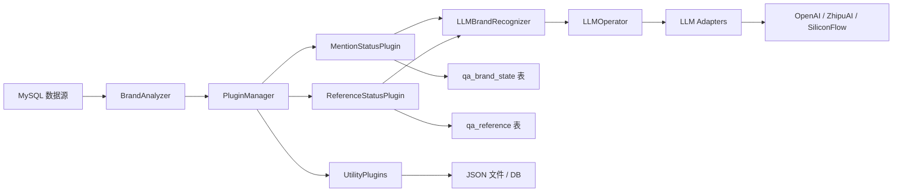
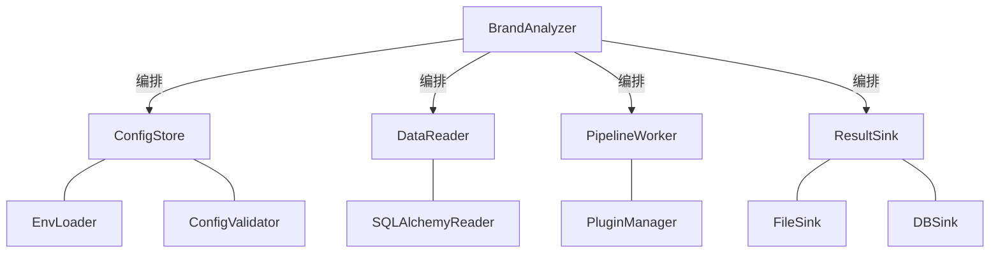

# Brand Analysis 架构诊断报告

> 诊断工具：`improve-codebase-architecture` 技能
> 诊断日期：2026-05-12
> 诊断范围：`src/` 全部模块、`config/`、`docs/`、`database/`、`tests/`

---

## 一、领域模型总览

本项目的核心领域是 **品牌 AI 认知分析**，核心流程为：



**核心实体关系：**

| 实体 | 职责 |
|------|------|
| `BrandAnalyzer` | CLI 入口 + 编排器，加载配置、调度插件、写文件 |
| `PluginManager` | 插件生命周期管理：发现、加载、配置注入 |
| `AnalysisPlugin` | 插件抽象基类，定义 `analyze()` / `aggregate_results()` 合同 |
| `PluginRegistry` | 装饰器式注册表，存储插件元信息 |
| `LLMBrandRecognizer` | 品牌识别业务服务，封装 prompt 构建和 LLM 调用 |
| `LLMOperator` | LLM 通信层：重试、缓存、统计、同步/异步桥接 |
| `BaseLLMAdapter` | SDK 适配器基类，统一多提供商响应格式 |

---

## 二、诊断发现

### 2.1 严重 — BrandAnalyzer 成为 God Object

`analyzer.py` 约 1254 行，承担了至少 6 种职责：

1. 配置加载与环境变量合并（`_load_config`）
2. 配置校验（`_validate_config`、`_validate_database_config`、`_validate_llm_config`）
3. 数据库引擎管理（`_get_database_engine`）
4. SQL 查询构建与执行（`_fetch_table_rows`）
5. 批处理编排与聚合（`analyze_configured_sources`、`_process_data_table`、`_process_table_batch`）
6. 文件输出（`_save_plugin_batch_result`）
7. CLI 参数解析与入口（`main`）

**问题表现：**
- 修改数据库查询逻辑需要动 `analyzer.py`
- 修改输出格式需要动 `analyzer.py`
- 修改配置校验规则需要动 `analyzer.py`
- `analyzer.py` 与 SQLAlchemy 硬耦合，无法替换数据源
- 测试困难：任何修改都需要模拟整个分析器

**建议拆分：**



### 2.2 严重 — 数据库引擎在多处重复创建

以下位置各自独立创建 SQLAlchemy engine：

| 位置 | 行号 | 方式 |
|------|------|------|
| `analyzer.py` `_get_database_engine` | L653-664 | `create_engine(f"mysql+pymysql://...")` |
| `mention_status.py` `_get_db_engine` | L91-129 | 完全相同的 URL 拼接 |
| `reference_status.py` `_get_db_engine` | L256-293 | 完全相同的 URL 拼接 |
| `import_mention_data.py` `_create_db_engine` | L43-58 | 使用 `quote_plus`，稍不同 |

**后果：**
- 连接池不共享，浪费资源
- 数据库密码散落在多个文件的字符串拼接中
- 修改连接参数需改 4 处
- 违反核心信念"配置驱动优先"和"数据形状先验证"

**建议：** 提取 `DatabaseManager` 单例，统一管理 engine 生命周期和连接配置。

### 2.3 严重 — 插件内数据库写入绕过 PluginManager

`MentionStatusPlugin.aggregate_results()` 和 `ReferenceStatusPlugin.aggregate_results()` 在聚合阶段直接执行 SQL INSERT/UPSERT 操作。这违反了架构文档中"插件边界稳定"的核心信念：

- `PluginManager` 无法感知或控制插件的数据库写入
- 写入失败时 `PluginManager` 的错误处理无法捕获
- `aggregate_results` 语义上应只是聚合计算，不应有副作用
- 测试时必须模拟整个数据库环境

**建议：** 插件只返回聚合结果，由 `BrandAnalyzer` 统一决定写入策略（文件、数据库或两者）。

### 2.4 高 — LLM 初始化逻辑三处重复

`MentionStatusPlugin._ensure_llm_initialized()`、`ReferenceStatusPlugin._ensure_llm_initialized()`、`ExtractSourcePlugin.__init__()` 中各自从 `llm_config` dict 手动提取参数创建 `LLMConfig` → `LLMOperator` → `LLMBrandRecognizer`，代码几乎相同。

**建议：** 提取 `create_llm_recognizer_from_config(llm_config: dict)` 工厂函数到 `business_services` 层。

### 2.5 高 — 配置键名不一致

配置中存在 camelCase 与 snake_case 混用：

| 配置文件键名 | 代码中查找方式 |
|-------------|---------------|
| `apiKey` | `llm_config.get("apiKey") or llm_config.get("api_key")` |
| `baseURL` | `llm_config.get("baseURL") or llm_config.get("base_url")` |
| `maxRetries` | `llm_config.get("maxRetries") or llm_config.get("max_retries")` |
| `maxTokens` | `llm_config.get("maxTokens") or llm_config.get("max_tokens")` |

每个使用点都要写 fallback 查找，增加维护负担且易遗漏。

**建议：** 统一为 snake_case（Python 惯例），或在配置加载层做一次归一化。

### 2.6 高 — `_to_tinyint_bool` 和 `_extract_value` 等工具函数多处重复

以下函数在至少 3 个文件中各自实现：

- `_to_tinyint_bool`：`mention_status.py`、`reference_status.py`、`import_mention_data.py`
- `_extract_value`：`mention_status.py`、`reference_status.py`
- `_extract_platform`：`mention_status.py`、`reference_status.py`
- `_extract_datasource_fields`：`mention_status.py`、`reference_status.py`
- `_get_db_engine` / `_get_db_cfg`：`mention_status.py`、`reference_status.py`、`analyzer.py`

**建议：** 提取到 `src/core/db_utils.py` 和 `src/core/data_utils.py`。

### 2.7 中 — PluginRegistry 使用类变量导致全局状态

`PluginRegistry._plugins` 是类级别的 `Dict`，这意味着：
- 不同测试之间状态泄露
- 无法在同一进程中加载不同插件集
- `@register` 装饰器在 import 时执行，副作用不可控

**建议：** 改为实例化注册表，由 `PluginManager` 持有。

### 2.8 中 — 异步/同步桥接模式脆弱

多处使用 `asyncio.run()` / `asyncio.get_running_loop()` 做同步转异步：

- `mention_status.py` `analyze()` L413-423
- `reference_status.py` `_classify_content_types()` L879-888
- `extract_source.py` `analyze()` L112-124
- `llm_operator.py` `chat_completion()` L589-607

这种模式在已有事件循环的环境中（如 Jupyter、FastAPI）会失败。当前代码虽然做了检测，但处理方式不一致（有的抛错，有的静默返回空结果）。

**建议：** 统一异步入口策略，或引入 `anyio` / `nest_asyncio` 做兼容处理。

### 2.9 中 — reference_status.py 职责过重

`reference_status.py` 超过 1040 行，内含：
- URL 标准化逻辑
- 已发布 URL 加载与缓存
- 规则型内容分类（硬编码了 ~200 个域名映射）
- LLM 内容分类
- 数据库 UPSERT

硬编码的域名列表占 ~200 行，应提取为配置或数据文件。

### 2.10 中 — 安全隐患

1. **`analysis_config.json` 包含明文密码**（L7: `"password": "123456"`），已在 `SECURITY.md` 中标记为 Watch Item
2. **`LLMPingPlugin` 使用 `requests` 库直接调用 LLM API**，绕过了 `LLMOperator` 的重试/缓存/错误处理机制，且日志中可能泄露 API Key
3. **`import_mention_data.py` 使用 `quote_plus` 编码密码**，其他三处不编码，行为不一致

### 2.11 低 — pyproject.toml 配置矛盾

- `[project.scripts]` 入口指向 `brand_analysis.analyzer:main`，但包名为 `src`（实际路径是 `src/analyzer.py`），这会导致 `pip install -e .` 后命令行入口不可用
- `mypy` 对 `src.analyzer`、`src.business_services.*`、`src.plugins.*`、`src.core.*` 全部 `ignore_errors = true`，形同虚设
- 声明依赖只有 `pydantic>=2.0.0`，但实际代码大量使用 `sqlalchemy`、`openai`、`requests`、`dotenv`（均为 optional/import 内引入）

### 2.12 低 — 插件 `plugins/__init__.py` 的 sys.modules hack

```python
sys.modules[__name__ + ".mention_status"] = _metrics_mention_status
```

这种动态修改 `sys.modules` 的方式是为了兼容扁平导入路径，但它：
- 使 IDE 无法正确解析
- 增加了调试难度
- 与 `PluginManager` 的 `importlib.import_module` 动态发现机制重复

### 2.13 低 — LLMOperator 中引用不存在的配置属性

`LLMOperator.get_config_info()` L741-746 中引用了 `self.config.enable_cache` 和 `self.config.enable_streaming`，但 `LLMConfig` dataclass 中只有 `use_cache` 和 `stream`，没有这两个属性名。这会在运行时抛 `AttributeError`。

---

## 三、架构健康度评分

| 维度 | 评分(1-5) | 说明 |
|------|----------|------|
| 模块边界 | 2 | 插件越界写入DB；analyzer 承担过多职责 |
| 配置驱动 | 3 | 基本实现，但键名不一致、多处硬编码 |
| 代码复用 | 2 | DB/LLM/工具函数大量重复 |
| 可测试性 | 2 | God Object + 全局注册表 + DB 耦合 |
| 依赖管理 | 2 | pyproject.toml 入口和依赖声明有误 |
| 安全性 | 3 | 有安全文档但明文密码仍存在 |
| 文档同步 | 4 | AGENTS.md + docs/ 体系完善 |
| 插件扩展性 | 3 | 注册表机制可用，但合同不够严格 |

**综合评分：2.6 / 5**

---

## 四、改进路线图建议

### Phase 1 — 消除重复（1-2 天）

1. 提取 `DatabaseManager`，统一 engine 创建
2. 提取 `create_llm_recognizer_from_config()` 工厂
3. 提取 `_to_tinyint_bool`、`_extract_value` 等到公共工具模块
4. 修复 `LLMConfig` 属性名不一致（`enable_cache` → `use_cache`）

### Phase 2 — 拆分 God Object（2-3 天）

1. 从 `BrandAnalyzer` 中提取 `ConfigStore`（配置加载 + 校验 + 环境变量合并）
2. 从 `BrandAnalyzer` 中提取 `DataReader`（SQLAlchemy 查询逻辑）
3. 从 `BrandAnalyzer` 中提取 `ResultSink`（文件输出 + 数据库写入）
4. `BrandAnalyzer` 只保留编排逻辑

### Phase 3 — 插件合同强化（2-3 天）

1. 将数据库写入从插件 `aggregate_results()` 移出到 `ResultSink`
2. `PluginRegistry` 改为实例化，消除全局状态
3. 统一异步入口策略
4. `reference_status.py` 中域名映射提取为 `data/domain_categories.json`

### Phase 4 — 工程规范修复（1-2 天）

1. 修复 `pyproject.toml` 入口和依赖声明
2. 统一配置键名为 snake_case（或加归一化层）
3. 移除 `sys.modules` hack
4. 逐步收紧 mypy 配置（先移除核心模块的 `ignore_errors`）

---

## 五、核心信念符合性检查

| 核心信念 | 符合度 | 差距 |
|---------|-------|------|
| 配置驱动优先 | 部分 | LLM 配置键名不统一；域名映射硬编码 |
| 插件边界稳定 | 违反 | 插件直接写数据库，绕过 PluginManager |
| 外部依赖可降级 | 部分 | LLM 有 fallback，但 DB 失败时整体崩溃 |
| 数据形状先验证 | 部分 | 配置校验充分，但运行时数据缺乏 schema 验证 |
| 规范跟代码同步 | 良好 | 架构文档与代码结构基本一致 |

---

## 六、总结

本项目的插件架构设计意图清晰，核心信念和文档体系在同类项目中属于上游水平。但实现层面存在三方面的技术债：

1. **God Object**：`BrandAnalyzer` 承担了过多横切关注点，导致修改任何单一职责都需要触及这个文件
2. **重复代码**：数据库、LLM、工具函数在 4 个位置重复实现，违反 DRY 原则
3. **插件合同不严**：`aggregate_results()` 执行副作用（写数据库），破坏了插件的可组合性和可测试性

建议按 Phase 1 → Phase 2 → Phase 3 → Phase 4 的顺序渐进改进，每个 Phase 都可以在不影响现有功能的前提下完成。
