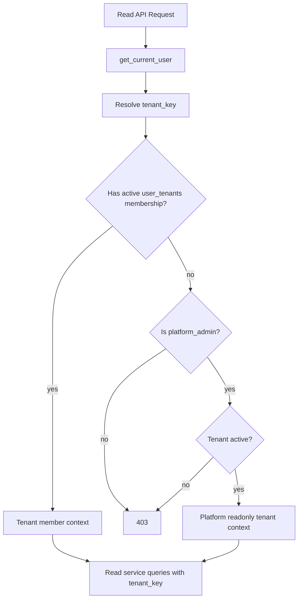

# 平台管理员全租户只读访问设计

> 日期：2026-05-20，2026-05-21 修订，2026-06-09 修订
>
> 状态：已实现
>
> 范围：平台管理员读取所有 active 租户 dashboard 数据和项目 GET 数据；不包含写操作、审计表和平台管理员表迁移。

## 1. 需求摘要

平台管理员需要从平台后台进入任意客户租户的项目工作台和 legacy dashboard 做排障和交付支持。该能力必须满足：

- 只读：覆盖 dashboard 查询接口和项目工作台 GET 接口。
- 不污染租户成员关系：不批量写入 `user_tenants`。
- 不降低普通用户隔离：非平台管理员仍按 membership 校验。
- 不扩大写权限：任务加载、成员管理、执行器管理继续按现有权限。

## 2. 备选方案

### 方案 A：给平台管理员写入所有租户 membership

优点：复用现有 `get_current_tenant`，实现简单。

缺点：污染客户成员关系，租户列表会出现所有客户，难以区分真实客户成员和平台旁路访问；后续审计和撤权成本高。

结论：不采用。

### 方案 B：读接口使用平台只读旁路依赖

优点：平台域和租户成员域保持分离；只读能力可限制在明确的 GET 路由；对现有 repository 的 `tenant_key` 过滤无影响。

缺点：需要新增一个依赖函数，并补足测试避免误放开写接口。

结论：采用。

### 方案 C：新增平台专用 dashboard API

优点：平台后台和租户工作台 API 完全分离。

缺点：会复制大量 dashboard 查询接口和前端数据消费逻辑，MVP 复杂度过高。

结论：暂不采用。

## 3. 目标设计

新增一个后端授权依赖，例如 `get_current_tenant_for_dashboard_read`：

1. 先解析 `Authorization` 得到 `CurrentUser`。
2. 读取目标 `tenant_key`，沿用当前 `X-Tenant-Key` 与 query 一致性校验。
3. 若用户有该租户 active membership，返回普通 `CurrentTenantContext`。
4. 若没有 membership，但用户是 `platform_admin`，查询目标租户是否 active。
5. active 时返回只读平台上下文，例如 role=`platform_admin_readonly`、product_role=`platform_admin`、access_scope=`platform_readonly`。
6. 非 active 租户、非平台管理员、无目标租户继续拒绝。

Dashboard 路由组和项目 GET 路由从 `Depends(get_current_tenant)` 改为只读依赖。写接口不改。

## 4. 数据流

## 5. 后端边界

建议新增或调整文件：

- `api/v1/dependencies/auth.py`
  - 新增只读依赖和只读上下文字段。
  - 不改变 `require_current_tenant(required_role="admin")` 行为。
- `api/v1/repositories/tenants.py`
  - 新增按 `tenant_key` 获取租户摘要的函数，或复用现有 membership 查询之外的租户读取。
- `api/v1/routes/dashboard.py`
  - 路由组依赖改为 dashboard 只读依赖。
- `api/v1/routes/projects.py`
  - 项目列表、项目详情、数据质量、报告列表和告警 GET 改为平台只读依赖；项目创建、品牌配置、问题集配置、报告生成等写接口不改。
- `api/tests/test_platform_admin_dashboard_access.py`
  - 覆盖平台只读放行和写接口不放行。

## 6. 前端边界

建议新增或调整：

- `web/src/components/platform/PlatformTenantsPage.jsx`
  - 租户行只保留“详情”按钮。
  - 详情页主按钮进入 `/projects/<tenantKey>`，项目行提供 `/projects/<tenantKey>/<projectId>` 和 `/projects/<tenantKey>/<projectId>/quality`。
  - 详情页排障入口再提供 `/tasks/<tenantKey>/status` 和真实 `latestJob` dashboard 入口，避免用前端 `.env` 的默认 job 拼接 dashboard URL。
- `web/src/components/DashboardLayout.jsx`
  - 平台只读进入某租户时，即使该租户不在 `user.tenants`，也不应重定向或清空页面。
  - 租户选择器仍只展示真实 membership。
  - Dashboard 需要品牌筛选时，从 URL `brand` 或 dashboard 数据首个品牌补齐，不使用 `VITE_DEFAULT_BRAND`。

## 7. 安全要求

- 平台只读旁路只允许明确列入的 GET：`/api/v1/dashboard/*`、`GET /api/v1/projects`、`GET /api/v1/projects/{project_id}`、`GET /api/v1/projects/{project_id}/data-quality`、`GET /api/v1/projects/{project_id}/reports`、`GET /api/v1/projects/{project_id}/alerts`。
- 所有业务查询仍必须携带 `tenant_key`。
- 平台只读上下文不能满足 `required_role="admin"`。
- 不把所有租户写入登录响应 `user.tenants`。
- 错误响应不泄露停用租户或不存在租户的敏感详情。

## 8. 测试策略

后端：

- 平台管理员无 membership 访问 dashboard 200。
- 平台管理员无 membership 访问 active 租户项目列表、项目详情和数据质量 200。
- 普通用户无 membership 访问 dashboard 403。
- 平台管理员访问 inactive 租户 403。
- 平台管理员访问租户写接口 403。
- 普通 tenant member 原有访问仍 200。

前端：

- 平台租户列表只暴露详情入口；详情页“进入项目工作台”、项目详情、数据质量和“任务状态”生成正确 URL。
- 平台 API 仍跳过 `X-Tenant-Key`。
- Dashboard API 对路由租户继续注入 `X-Tenant-Key`。
- 前端不再依赖 `VITE_DEFAULT_TENANT_KEY`、`VITE_DEFAULT_JOB_ID`、`VITE_DEFAULT_BRAND`。

## 9. ADR

**决策**：平台管理员获得 dashboard 和项目 GET 级全租户只读旁路，不通过 `user_tenants` 表达。

**理由**：平台管理员是平台域身份，`user_tenants` 是客户域成员关系。把两者混在一张关系表中会让租户成员、登录默认租户、客户审计和撤权语义变乱。路由级只读依赖可以把平台排障能力限制在 dashboard 读接口内。

**后果**：实现时必须精确限定依赖使用范围，并用测试证明写接口不被放开。
