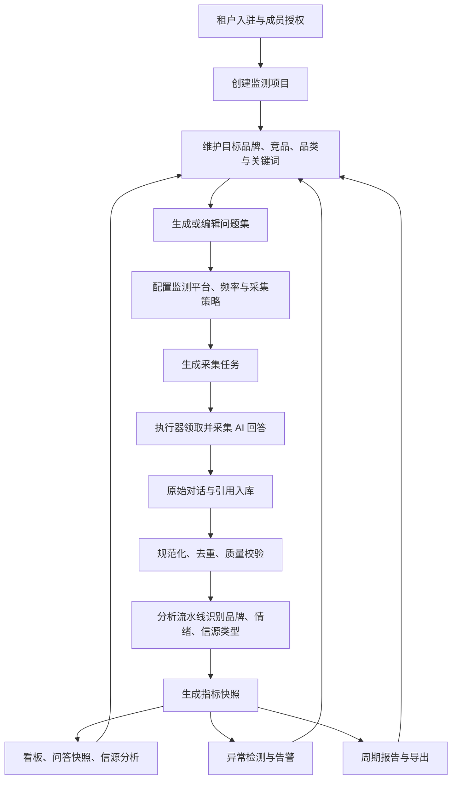

# 品牌监测业务系统架构评估与重构建议

> 评估日期：2026-06-06  
> 评估对象：`brand-dashboard` 当前工作区  
> 评估视角：产品业务流程、领域模型、数据生命周期  
> 结论摘要：当前项目已经具备 AI 品牌监测仪表板 MVP 的骨架，但更像“围绕批次数据表构建的看板系统”，还不是一个完整的品牌监测业务系统。后续重构应以“监测项目”为业务主线，补齐采集编排、分析流水线、指标快照、告警报告和数据治理。

## 1. 一句话结论

这个项目的技术分层基本合理，前后端分离、多租户隔离、任务执行器、原始对话入库、指标看板等关键能力都已经出现；但业务抽象还停留在 `tenant_key + job_id` 的批次视角，缺少“品牌客户长期监测一个市场/品类/品牌组合”的核心领域模型。

如果继续在当前模型上堆功能，系统会越来越依赖 `llm_query_jobs`、`llm_conversations`、`qa_brand_state`、`qa_reference` 这些数据表的偶然结构，后续很难稳定支持持续监测、历史对比、重算、告警、报告、任务失败恢复和跨项目运营。因此，建议保留现有技术栈和多租户边界，以模块化单体方式重构为完整的品牌监测业务系统。

## 2. 当前系统是什么

从 README、PRD、API、数据库 schema 和前后端代码看，当前系统的产品定位是“AI 平台品牌监测与分析仪表板”。它关注的不是传统社媒或搜索舆情，而是品牌在大语言模型平台回答中的出现频率、排名、情绪倾向和引用信源。

当前已经具备的核心链路如下：

1. 平台运营人员创建租户，租户管理员激活账号，租户成员登录系统。
2. 租户管理员创建查询任务，指定目标品牌、竞品、品类、关键词、问题、执行器和执行次数。
3. 执行器通过 `/api/v1/query-jobs/fetch` 拉取待执行问题，调用外部 AI 平台，拿到回答和引用链接。
4. 执行器通过 `/api/v1/conversation/load` 写入原始对话和引用，通过 `/api/v1/query-jobs/report` 更新任务执行次数。
5. `analysis/` 目录下的批处理分析工具读取原始对话和引用，再写入 `qa_brand_state`、`qa_reference` 等指标明细表。
6. 前端仪表板按 `tenant_key + job_id + timeframe` 查询 dashboard API，展示品牌提及率、平台分布、趋势、信源、情感等页面。

这条链路说明项目已经不只是静态 dashboard，而是具备“任务 -> 采集 -> 入库 -> 分析 -> 展示”的雏形。

## 3. 架构合理的地方

### 3.1 技术边界清楚

`web/` 负责 React UI，`api/` 负责 FastAPI 数据接口，数据库只由后端访问。这个边界是正确的，也符合后续 SaaS 化和多租户扩展需要。

### 3.2 多租户方向正确

系统以 `tenant_key` 做租户隔离，认证依赖会校验用户身份、租户 membership 和角色。平台后台 `/platform/*` 与租户工作台分离，这一点很关键，避免了平台管理员身份和客户租户身份混在一起。

### 3.3 看板粒度明确

现有 dashboard 明确要求 `tenant_key + job_id` 才能展示，这比只按租户查全量数据更安全，也能支持不同批次、不同品牌或不同时间段的数据隔离。

### 3.4 指标查询已形成服务层

`DashboardService` 把 API 层和 Repository 查询隔开，品牌提及、趋势、信源、筛选元数据等能力已经有稳定入口。后续迁移到新的指标快照模型时，可以保留这层作为兼容外壳。

### 3.5 分析能力有插件化雏形

`analysis/` 里的 `BrandAnalyzer`、`PluginManager`、`mention_status`、`reference_status` 表明团队已经意识到分析逻辑需要可扩展。品牌提及、竞品识别、情绪、信源分类这类能力适合插件化或流水线化。

## 4. 当前主要问题

### 4.1 产品主线不是“监测项目”，而是“任务批次”

完整的品牌监测系统通常围绕一个长期存在的“监测项目”运转，例如：

- 某客户要监测“高端新能源车”赛道。
- 目标品牌是 A，竞品是 B/C/D。
- 监测平台包括 DeepSeek、豆包、通义千问、Kimi。
- 问题集按购买前决策、价格、售后、口碑等主题维护。
- 系统每天采集、分析、沉淀趋势，并在异常时告警。

当前系统没有一等公民的 `MonitoringProject`。`job_id` 承担了太多含义：它既像任务批次，又像 dashboard 展示单元，也像业务分析范围。这会导致后续很难回答这些问题：

- 一个品牌的长期监测项目是什么？
- 哪些关键词和问题属于同一个项目？
- 本次采集属于第几轮，覆盖哪些平台？
- 这次指标是由哪一版问题集、哪一次采集、哪一版分析模型产生的？
- 用户想看“项目过去 90 天趋势”时，应跨哪些 `job_id`？

### 4.2 `llm_query_jobs` 混合了任务定义和任务执行

`llm_query_jobs` 现在一行就是一个具体问题，同时又带 `job_id`、`brand`、`competitor`、`executor_id`、`total_runs`、`executed_runs`、`query_status`、生效时间等字段。

这使它同时扮演了这些角色：

- 监测配置的一部分。
- Prompt/问题明细。
- 采集任务队列。
- 执行状态表。
- dashboard 批次入口。

这个模型可以支撑 MVP，但不利于稳定调度。后续如果要支持多平台、多执行器、失败重试、任务锁定、暂停恢复、按项目重跑、按问题禁用，就需要把“任务定义”和“执行尝试”拆开。

### 4.3 原始数据、分析结果、指标快照边界不够清楚

当前有两组相似数据：

- 原始层：`llm_conversations`、`llm_conversation_references`
- 分析层：`qa_brand_state`、`qa_reference`、`qa_brand_summary`

这个方向是对的，但边界还不完整：

- `qa_reference` 与 `llm_conversation_references` 字段大量重复，像“分析后的引用表”，但没有明确的 `analysis_run_id` 或版本。
- `qa_brand_state` 记录品牌提及状态，但没有标记它由哪个分析任务、哪版模型、哪版提示词生成。
- dashboard 直接从分析明细表聚合，缺少面向看板的稳定指标快照层。
- 重跑分析时缺少清晰的幂等规则和数据血缘，容易产生重复或覆盖不明。

一个完整系统应该把数据分成四层：原始采集层、规范化事实层、分析结果层、指标快照层。

### 4.4 数据生命周期缺少状态机

目前任务状态只有 `query_status`，执行器上报只更新执行次数。`conversation/load` 与 `query-jobs/report` 是两个独立动作，系统无法完整表达一次采集 attempt 的生命周期。

缺少的关键状态包括：

- 待领取、已领取、执行中、成功、失败、超时、取消。
- 执行器领取任务后的 reservation/lease。
- 单次执行 attempt 的开始时间、结束时间、错误原因、原始响应大小、引用数量。
- 原始数据入库成功但分析未完成的状态。
- 分析结果已过期、待重算、重算失败。
- 指标快照是否新鲜、是否完整覆盖目标平台和问题集。

这些状态对业务很重要。没有它们，用户看到 dashboard 空数据时，系统无法清楚告诉他是“还没采集”、“采集失败”、“采集成功但未分析”，还是“分析完成但当前筛选无数据”。

### 4.5 分析引擎与 API 服务没有形成产品化流水线

`analysis/` 目录具备插件化分析能力，但当前更像一个独立 CLI/库，靠配置读取数据库，再写回 `qa_*` 表。API 服务没有把它纳入统一的任务生命周期。

这带来几个问题：

- 用户在 Web 端创建任务后，不知道什么时候自动触发分析。
- 分析配置、LLM 模型、插件版本没有成为可追踪的业务数据。
- 分析失败无法反馈到任务状态或 dashboard。
- API 中 `/api/v1/analysis/*` 有部分接口仍是占位或旧调用方式，和 `analysis/` 当前实现不完全一致。

### 4.6 指标幂等性和唯一键存在风险

`analysis/src/plugins/metrics/mention_status.py` 的 upsert 注释依赖 `qa_brand_state` 存在唯一键：

`(tenant_key, job_id, conversation_id, brand)`

但当前 `api/database/schema_business.sql` 中 `qa_brand_state` 没有这个唯一键，只有普通索引。这意味着重复运行分析时，`ON DUPLICATE KEY UPDATE` 不会按预期生效，可能插入重复品牌状态，进而污染提及率、首位提及率、Top3 提及率。

另外，`qa_reference` 和 `llm_conversation_references` 的唯一键是 `(tenant_key, conversation_id, url)`，没有包含 `job_id` 和 `brand`。如果同一个租户下不同任务或不同品牌复用了相同 `conversation_id + url`，会产生覆盖或冲突风险。

### 4.7 看板仍有“展示产品”而不是“运营系统”的痕迹

当前前端已经有首页、趋势、分平台、信源、情感、任务管理和平台后台，但完整业务系统还缺：

- 监测项目列表与项目详情。
- 品牌与竞品配置。
- 问题库和关键词库。
- 问答快照页面。
- 采集运行记录和失败原因。
- 告警规则。
- 周报/月报和导出。
- 数据质量与覆盖率提示。

其中情感分析页面当前仍使用 mock 情感数据，这说明 dashboard 展示还没有完全接入真实分析生命周期。

## 5. 目标业务流程

建议把产品业务流程重构为以下闭环：



这个流程的核心变化是：用户不再直接围绕 `job_id` 工作，而是围绕“监测项目”工作。`job_id` 变成系统内部的采集批次或运行批次。

## 6. 目标领域模型

### 6.1 租户与权限域

保留当前租户与用户模型：

- `Tenant`：客户组织。
- `User`：登录账号。
- `TenantMembership`：用户在租户内的角色。
- `PlatformAdmin`：平台运营身份，建议从环境变量白名单逐步迁移到数据库表。

### 6.2 品牌监测域

新增或重构为这些核心实体：

| 实体 | 说明 |
|------|------|
| `MonitoringProject` | 一个长期监测项目，例如“某品牌在高端新能源车赛道的 AI 推荐表现”。 |
| `BrandProfile` | 品牌档案，包含标准名、别名、官网、行业、产品线等。 |
| `ProjectBrand` | 项目中的品牌角色，区分 `target`、`competitor`、`watch_only`。 |
| `TopicKeyword` | 项目关键词或购买决策主题。 |
| `PromptSet` | 某一版问题集，可版本化。 |
| `PromptItem` | 单条消费者问题，归属于关键词、平台策略或问题集。 |
| `PlatformTarget` | 需要监测的 AI 平台及平台配置。 |

### 6.3 采集编排域

| 实体 | 说明 |
|------|------|
| `CollectionJob` | 一次采集批次，关联项目、问题集版本、平台范围和时间窗口。 |
| `CollectionTask` | 可被执行器领取的最小任务，例如“某平台 + 某问题 + 第 N 次执行”。 |
| `CollectionAttempt` | 单次执行尝试，记录领取、运行、成功、失败、耗时、错误和执行器。 |
| `Executor` | 采集执行器，保留现有模型，但增加能力标签、平台支持和心跳。 |

### 6.4 原始数据域

| 实体 | 说明 |
|------|------|
| `AnswerSnapshot` | AI 平台对某个问题的一次回答快照，对应当前 `llm_conversations`。 |
| `AnswerReference` | 回答中的引用链接，对应当前 `llm_conversation_references`。 |
| `SourceDomain` | 规范化域名档案，包括中文名、类型、权威等级、是否自有/合作媒体。 |

### 6.5 分析与指标域

| 实体 | 说明 |
|------|------|
| `AnalysisRun` | 一次分析运行，记录插件、模型、提示词版本、输入范围和状态。 |
| `BrandMentionFact` | 某回答中某品牌是否提及、是否首位、是否 Top3、情绪等。 |
| `ReferenceClassification` | 某引用链接的内容类型、是否发稿链接、来源质量等。 |
| `MetricSnapshot` | 面向 dashboard 的稳定指标快照，按项目、品牌、平台、关键词、日期聚合。 |
| `Insight` | 自动发现的洞察，例如某平台声量下降、某信源贡献异常升高。 |
| `AlertRule` / `AlertEvent` | 告警规则和触发事件。 |
| `Report` | 周报、月报、客户导出报告。 |

## 7. 推荐系统架构

短中期不建议拆微服务。当前规模下，保持 FastAPI + MySQL 的模块化单体更稳妥，先把领域边界和数据生命周期理顺。

推荐后端模块结构：

```text
api/v1/
  identity/            # 用户、租户、平台管理员、权限依赖
  projects/            # 监测项目、品牌、竞品、关键词、问题集
  collection/          # 采集任务、执行器领取、attempt、心跳、重试
  ingestion/           # 原始对话和引用入库、去重、规范化
  analysis_pipeline/   # 分析运行、插件调度、模型配置、结果入库
  metrics/             # 指标口径、快照生成、dashboard read models
  insights/            # 异常检测、告警、报告
  platform_ops/        # 平台后台租户、执行器、运行状态总览
```

前端信息架构建议：

```text
租户工作台
  项目列表
  项目详情
    总览
    趋势
    分平台
    信源
    问答快照
    告警
    报告
    设置：品牌、竞品、关键词、问题集、平台、频率
  任务运行
    采集批次
    执行尝试
    分析运行

平台运营后台
  租户管理
  执行器管理
  全局采集健康度
  队列与失败任务
  模型与配置治理
```

## 8. 数据模型重构建议

### 8.1 拆分 `llm_query_jobs`

当前 `llm_query_jobs` 不建议继续作为唯一任务表。建议拆为：

- `monitoring_projects`：项目主表。
- `project_brands`：目标品牌和竞品。
- `prompt_sets`：问题集版本。
- `prompt_items`：问题明细。
- `collection_jobs`：采集批次。
- `collection_tasks`：待执行任务。
- `collection_attempts`：执行尝试。

迁移时可以先保留 `llm_query_jobs` 作为兼容表或视图，由新表生成旧表需要的数据，避免一次性打断前端和执行器。

### 8.2 明确原始层与分析层

建议把当前表映射为：

| 当前表 | 目标定位 |
|--------|----------|
| `llm_conversations` | 原始回答快照 `answer_snapshots` |
| `llm_conversation_references` | 原始引用链接 `answer_references` |
| `qa_brand_state` | 分析事实 `brand_mention_facts` |
| `qa_reference` | 引用分析事实 `reference_classifications` |
| `qa_brand_summary` | 可废弃或迁移为指标快照的一种物化结果 |

### 8.3 增加分析运行与指标快照

新增：

- `analysis_runs`：记录分析状态、插件版本、模型、输入范围、开始/结束时间、错误信息。
- `metric_snapshots`：按 `project_id + date + brand_id + platform + keyword` 聚合后的指标。
- `metric_snapshot_versions`：如果需要重算，可记录快照版本和生效状态。

dashboard 优先读 `metric_snapshots`，而不是每次从明细表实时聚合。这样能提升性能，也能保证用户看到的是“已完成、可解释”的指标版本。

### 8.4 修复幂等唯一键

建议至少增加这些唯一约束：

- `brand_mention_facts`：`(tenant_key, analysis_run_id, answer_snapshot_id, brand_id)`，或兼容阶段使用 `(tenant_key, job_id, conversation_id, brand)`。
- `reference_classifications`：`(tenant_key, analysis_run_id, answer_reference_id, brand_id)`，或兼容阶段使用 `(tenant_key, job_id, conversation_id, brand, url_hash)`。
- `answer_snapshots`：`(tenant_key, collection_attempt_id, platform, prompt_item_id)`，或明确全局 `conversation_id` 的生成规则。
- `answer_references`：使用 `url_hash` 避免长 URL 前缀索引截断问题。

## 9. 数据生命周期重构建议

### 9.1 采集任务状态机

`CollectionTask` 建议使用：

- `pending`：待领取。
- `reserved`：已被执行器领取，lease 未过期。
- `running`：执行器确认开始执行。
- `succeeded`：原始回答入库完成。
- `failed`：执行失败，可重试。
- `expired`：超过有效期。
- `cancelled`：用户或系统取消。

`CollectionAttempt` 记录每一次尝试，避免只在任务表上累加次数。

### 9.2 分析状态机

`AnalysisRun` 建议使用：

- `pending`：等待分析。
- `running`：分析中。
- `succeeded`：分析结果入库成功。
- `failed`：分析失败。
- `stale`：上游原始数据或分析配置变化，需要重算。

### 9.3 指标快照状态

指标快照应有：

- 数据窗口：`metric_date` 或 `start_date/end_date`。
- 覆盖范围：项目、品牌、平台、关键词。
- 版本：由哪次 `analysis_run` 生成。
- 新鲜度：`generated_at`、`source_watermark`。
- 完整性：期望采集数、成功采集数、分析成功数。

这样 dashboard 才能解释“指标可信度”和“数据是否完整”。

## 10. API 重构建议

建议从 dashboard API 为中心，逐步转向项目 API 为中心：

```text
GET  /api/v1/projects
POST /api/v1/projects
GET  /api/v1/projects/{project_id}
POST /api/v1/projects/{project_id}/brands
POST /api/v1/projects/{project_id}/prompt-sets
POST /api/v1/projects/{project_id}/collection-jobs
GET  /api/v1/projects/{project_id}/collection-jobs
GET  /api/v1/collection-tasks/fetch
POST /api/v1/collection-attempts/{attempt_id}/complete
POST /api/v1/answers/load
POST /api/v1/analysis-runs
GET  /api/v1/projects/{project_id}/metrics/overview
GET  /api/v1/projects/{project_id}/metrics/trends
GET  /api/v1/projects/{project_id}/answers
GET  /api/v1/projects/{project_id}/alerts
GET  /api/v1/projects/{project_id}/reports
```

兼容期保留当前 `/api/v1/dashboard/*`，但内部改为从 `project_id/job_id` 映射到新 read model。

## 11. 分阶段重构路线

### 阶段 0：稳定现有 MVP

目标：先防止数据继续变脏。

- 为 `qa_brand_state` 补齐幂等唯一键或先增加重复数据检测脚本。
- 明确 `conversation_id` 是否跨 job 唯一；如果不是，唯一键必须包含 `job_id`。
- 把 `analysis/config/analysis_config.json` 中的真实数据库连接信息移出版本化配置，改为 example + 环境变量。
- 给 `conversation/load` 和 `query-jobs/report` 增加一致性约束：原始数据入库成功后再完成 attempt，或引入临时 attempt 表。
- 让情感分析页面停止使用纯 mock 作为正式数据来源，至少展示“真实数据未接入”的空状态。

### 阶段 1：引入监测项目

目标：把业务入口从 `job_id` 转到 `project_id`。

- 新增 `monitoring_projects`、`project_brands`、`prompt_sets`、`prompt_items`。
- 新建项目列表和项目详情页。
- 新建任务时先选项目，再生成采集批次。
- 当前 `llm_query_jobs.job_id` 继续保留，但新增 `project_id` 或通过映射表关联。

### 阶段 2：拆出采集运行模型

目标：让采集可靠、可追踪。

- 新增 `collection_jobs`、`collection_tasks`、`collection_attempts`。
- 执行器 fetch 改为领取 `collection_task`，并写入 lease。
- 支持任务超时释放、失败重试、执行器心跳。
- 平台后台增加执行器健康、失败任务、队列长度。

### 阶段 3：产品化分析流水线

目标：把 `analysis/` 从独立 CLI 变成系统内可观察流水线。

- 把分析插件封装成 API 可调度的 worker 或内部 service。
- 新增 `analysis_runs`，记录插件、模型、提示词版本、输入范围、状态。
- 分析结果写入带 `analysis_run_id` 的事实表。
- dashboard 可以显示“采集完成，分析中”或“分析失败”的状态。

### 阶段 4：建设指标快照与洞察

目标：让 dashboard 成为稳定 read model。

- 新增 `metric_snapshots`，dashboard 优先读取快照。
- 明确每个指标口径：分母、过滤范围、是否按问题去重、是否按品牌角色区分。
- 支持同环比、Top N 变化、平台差异、信源变化。
- 增加 `insights` 和 `alert_events`，将异常变化转化为业务动作。

### 阶段 5：完善客户交付闭环

目标：从看板走向业务系统。

- 增加问答快照页，支持按品牌、平台、关键词、情绪、是否引用过滤。
- 增加报告模块，支持周报/月报、PDF/Excel 导出。
- 增加品牌设置页，支持别名、竞品、关键词、问题集版本管理。
- 增加数据质量页，显示覆盖率、失败任务、过期指标、重算入口。

## 12. 优先级建议

最高优先级：

1. 修复幂等唯一键和重复数据风险。
2. 把“监测项目”作为一等业务对象。
3. 拆出采集 attempt，解决任务领取、失败、重试和入库一致性。
4. 把分析运行纳入系统状态，而不是依赖手动或外部 CLI。

中等优先级：

1. 建立指标快照层。
2. 完善问答快照和真实情感分析。
3. 建立 SourceDomain 信源字典。
4. 平台后台增加执行器健康和任务运行总览。

较低优先级：

1. 微服务拆分。
2. 引入复杂消息队列。
3. 大规模实时流处理。

当前项目仍适合“无聊技术优先”：MySQL + FastAPI + 后台 worker/定时任务即可完成下一阶段。只有当采集任务量和分析并发明显上升后，再评估 Redis/RQ、Celery、Kafka 或独立分析服务。

## 13. 建议的目标架构判断

合理的最终形态不是“一个 dashboard 项目加一个分析脚本”，而是：

- 一个多租户品牌监测 SaaS。
- 一个以 Monitoring Project 为中心的业务系统。
- 一个可追踪的采集与分析流水线。
- 一个有指标快照、数据血缘和新鲜度的 BI read model。
- 一个能把指标变化转成告警、洞察和报告的客户交付系统。

这套架构可以继续沿用当前 React + FastAPI + SQLAlchemy + MySQL 的技术栈。真正需要重构的不是技术栈，而是领域模型和数据生命周期。

