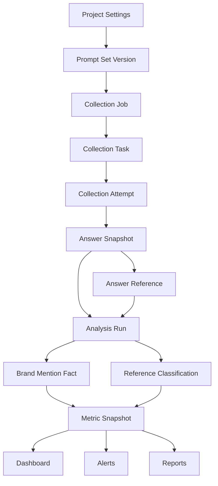

# 品牌监测业务系统目标架构设计

> 日期：2026-06-06
> 状态：规划中
> 关联规格：`docs/product-specs/20260606-brand-monitoring-system-refactor.md`
> 关联评估：`docs/design-docs/20260606-brand-monitoring-business-architecture-refactor.md`

## 1. 需求摘要

当前系统已经具备多租户 dashboard、执行器采集和分析插件雏形，但业务边界主要围绕 `job_id`。目标架构需要把系统主线切换到“监测项目”，同时保留现有 MVP 能力，降低一次性重构风险。

功能性要求：

- 租户可以创建和管理长期监测项目。
- 项目可以管理目标品牌、竞品、关键词、问题集、平台和采集策略。
- 采集任务需要可领取、可重试、可追踪、可解释失败。
- 原始数据、分析事实和事实聚合指标需要有明确边界。
- dashboard、问答快照、告警、报告都应基于同一套项目和数据生命周期。

非功能性要求：

- 多租户隔离不能退化。
- 现有 dashboard 和执行器接口需要兼容迁移。
- 短中期保持模块化单体，避免过早微服务化。
- 数据模型必须支持幂等写入、重算和数据血缘追踪。
- 文档、测试和执行计划必须随阶段同步。

## 2. 架构选择

### 2.1 采用模块化单体

继续使用 FastAPI + SQLAlchemy + MySQL，按领域模块拆分代码，不在当前阶段拆独立服务。

理由：

- 当前系统规模和团队约束更适合低运维复杂度。
- 主要问题是领域模型和数据生命周期，而不是服务边界。
- 后续如果分析并发或采集队列压力明显上升，可以先引入 worker 进程，再评估服务拆分。

### 2.2 采用项目中心的领域模型

`MonitoringProject` 成为租户内核心对象。`job_id` 降级为兼容期的采集批次或展示映射，不再作为用户理解系统的中心。

### 2.3 采用写模型与读模型分离

采集、分析属于写模型；dashboard、报告、告警读取 Repository 层的事实聚合指标和查询模型。短期不引入独立指标快照表或 OLAP。

## 3. 目标模块

```text
api/v1/
  identity/
    users, tenants, memberships, platform roles
  projects/
    monitoring projects, brands, competitors, keywords, prompt sets
  collection/
    collection jobs, tasks, attempts, executor leases
  ingestion/
    answer snapshots, references, source normalization
  analysis_pipeline/
    analysis runs, plugin adapters, model config, result persistence
  metrics/
    metric snapshots, dashboard read models, metric definitions
  insights/
    alert rules, alert events, reports, generated insights
  platform_ops/
    tenant operations, executor health, queue health
```

前端对应模块：

```text
web/src/
  api/projects.js
  api/collection.js
  api/metrics.js
  api/insights.js
  components/projects/
  components/project-runs/
  components/project-settings/
  components/answers/
  components/alerts/
  components/reports/
```

## 4. 数据流



## 5. 数据层分层

| 层级 | 代表数据 | 作用 |
|------|----------|------|
| 配置层 | project、brand、keyword、prompt、platform | 表达用户要监测什么。 |
| 编排层 | collection_job、collection_task、collection_attempt | 表达系统怎样采集。 |
| 原始层 | answer_snapshot、answer_reference | 保存外部 AI 平台返回事实。 |
| 分析层 | analysis_run、brand_mention_fact、reference_classification | 保存模型和规则分析结果。 |
| 指标层 | fact_metric_aggregation | 面向 dashboard、报告和告警的事实聚合读模型。 |
| 洞察层 | insight、alert_event、report | 把指标变化转成业务动作。 |

## 6. 兼容策略

1. 保留现有 `llm_query_jobs`、`llm_conversations`、`llm_conversation_references`、`qa_brand_state`、`qa_reference` 和 dashboard API。
2. 新增项目和采集运行表后，通过映射字段或兼容视图让旧 dashboard 继续可用。
3. 新 dashboard API 优先按 `project_id` 查询；旧 dashboard API 在内部解析到项目或兼容 job。
4. 执行器接口分两阶段迁移：先补充 attempt 和 lease，再切换 fetch/report 到新任务模型。
5. `analysis/` 先作为内部可调用库接入 API，再演进为 worker。

## 7. 安全边界

- 所有租户业务表继续保留 `tenant_key`，所有业务 Repository 必须显式接收服务端校验后的 `tenant_key`。
- Access token 只表示用户身份，不直接授权租户。
- 平台后台不发送 `X-Tenant-Key`，平台只读 dashboard 旁路只允许读接口。
- 执行器身份继续与用户身份分离，执行器只能处理已分配任务。
- 分析运行写入必须绑定租户、项目、采集批次和输入范围，避免跨租户重算。

## 8. ADR

### ADR-001：继续采用模块化单体

**决策**：短中期不拆微服务，先在 FastAPI 内按领域模块重构。

**理由**：现有系统的主要复杂度来自领域模型不清，而不是单体承载能力不足。模块化单体可以降低部署和排障成本。

**后果**：需要严格执行模块边界，避免继续把所有 SQL 和业务逻辑堆到通用 repository。

### ADR-002：以监测项目取代 job 作为业务主线

**决策**：新增 `MonitoringProject`，用户工作台围绕项目组织页面和 API。

**理由**：品牌监测是长期业务，不是一次采集批次。项目模型能承载品牌、竞品、关键词、问题集、平台、频率和历史趋势。

**后果**：当前 `job_id` 需要兼容迁移；旧路由和旧 API 不能立即删除。

### ADR-003：引入采集 attempt

**决策**：将任务定义、任务领取和执行尝试拆开，新增 attempt 级状态。

**理由**：当前只靠 `executed_runs` 无法表达失败、超时、重试、lease、执行器异常和入库一致性。

**后果**：执行器协议需要分阶段升级，并保留旧 fetch/report 兼容窗口。

### ADR-004：dashboard 读取事实聚合指标

**决策**：当前目标状态下 dashboard 不引入独立指标快照表，而是在 Repository 层基于 `qa_brand_state`、`qa_reference` 和 `analysis_runs` 聚合 `brand_metrics_v1` 指标。

**理由**：本分支尚未生产发布，独立快照表缺少生成、失效、重算和保留策略。事实聚合能先保持口径一致、血缘清晰和数据解释简单。

**后果**：需要把性能和数据质量观察点放在 Repository 聚合、查询索引和项目数据质量页；后续若重新引入物化 read model，必须先补齐生命周期策略。

### ADR-005：分析运行必须可追踪

**决策**：所有分析结果都必须关联 `analysis_run_id`。

**理由**：品牌识别、情绪、信源分类都依赖模型、提示词和插件版本，没有运行记录就无法重算、审计或解释差异。

**后果**：`analysis/` 不能再只是外部 CLI 写库，需要进入系统可观察流程。

## 9. 风险与缓解

| 风险 | 影响 | 缓解 |
|------|------|------|
| 一次性迁移过大 | dashboard 或执行器中断 | 分阶段兼容旧表和旧 API。 |
| 指标口径变化 | 客户前后数据不一致 | `brand_metrics_v1` 记录事实聚合口径，报告生成时固化当时的指标 JSON。 |
| 重复数据污染 | 提及率和引用率失真 | 先修复唯一键和幂等写入。 |
| 分析成本上升 | LLM 调用费用增加 | 分析运行去重、缓存、失败重试和按需重算。 |
| 前端路由复杂 | 用户迷失在 job/project 两套入口 | 新页面以 project 为主，旧入口逐步跳转或隐藏。 |
