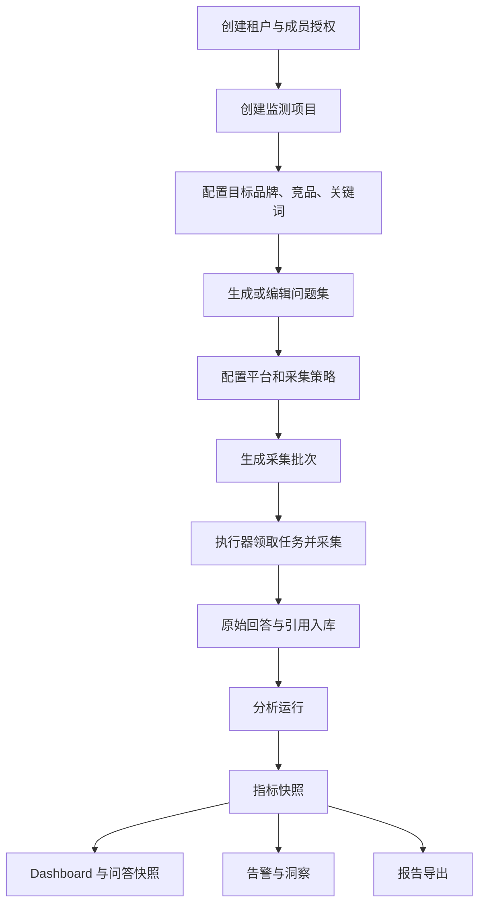

# 品牌监测业务系统重构规格

> 状态：规划中
> 日期：2026-06-06
> 背景文档：`docs/design-docs/20260606-brand-monitoring-business-architecture-refactor.md`

## 1. 背景

当前 Brand Dashboard 已经具备多租户、查询任务、执行器采集、原始对话入库、分析指标和 dashboard 展示能力。现有产品主线以 `tenant_key + job_id` 为最小展示单元，适合 MVP 看板，但还不足以支撑完整品牌监测业务。

品牌客户真实使用时，核心对象不是一次 `job_id`，而是一个长期存在的监测项目：它包含目标品牌、竞品、品类、关键词、问题集、平台范围、采集频率、历史趋势、异常告警和周期报告。因此，本规格定义后续重构的产品边界，把系统从“批次看板”升级为“品牌 AI 认知监测业务系统”。

## 2. 目标

1. 引入“监测项目”作为租户工作台的核心业务对象。
2. 支持租户围绕项目维护目标品牌、竞品、关键词、问题集、平台范围和采集策略。
3. 将采集任务、执行尝试、原始回答、分析运行、指标快照串成可追踪的数据生命周期。
4. 保留现有 dashboard 能力，同时逐步改为从项目和指标快照读取数据。
5. 为问答快照、真实情感分析、告警、报告和数据质量治理预留业务边界。

## 3. 非目标

1. 本阶段不引入微服务拆分。
2. 本阶段不替换 React、FastAPI、SQLAlchemy、MySQL 技术栈。
3. 本阶段不改变多租户共享数据库、应用层强制隔离的基本模式。
4. 本阶段不一次性删除当前 `/api/v1/dashboard/*`、`llm_query_jobs` 或 `qa_*` 表。
5. 本阶段不承诺接入新的外部 AI 平台，只梳理可扩展边界。

## 4. 用户角色

| 角色 | 说明 |
|------|------|
| 平台运营人员 | 管理租户、执行器、采集健康度和全局运行状态。 |
| 租户管理员 | 配置监测项目、品牌、竞品、问题集、采集策略和成员权限。 |
| 品牌经理 | 查看项目 dashboard、趋势、信源、问答快照、告警和报告。 |
| 执行器程序 | 领取采集任务，调用 AI 平台，回传回答和引用。 |
| 分析任务程序 | 对原始回答执行品牌识别、情感识别、信源分类和指标生成。 |

## 5. 核心用户故事

### 5.1 监测项目

1. As a 租户管理员，I want 创建一个品牌监测项目并填写行业、品类、项目周期，so that 团队可以围绕同一个业务范围持续监测。
2. As a 租户管理员，I want 为项目配置目标品牌和竞品，so that 指标可以区分自身表现和竞品对比。
3. As a 租户管理员，I want 维护品牌别名和常见写法，so that 品牌识别更稳定。
4. As a 品牌经理，I want 从项目列表进入项目详情，so that 我不用记住或选择底层 job_id。

### 5.2 问题集与采集策略

1. As a 租户管理员，I want 为项目维护关键词和消费者问题，so that 采集范围符合真实购买决策场景。
2. As a 租户管理员，I want 保存问题集版本，so that 后续指标可以追溯到当时使用的问题版本。
3. As a 租户管理员，I want 选择监测平台、采集频率和执行次数，so that 系统可以自动生成采集任务。
4. As a 执行器程序，I want 领取明确的采集任务并获得 lease，so that 多个执行器不会重复处理同一任务。

### 5.3 数据与分析

1. As a 执行器程序，I want 上报一次采集尝试的成功或失败，so that 系统可以追踪每次执行的真实状态。
2. As a 分析任务程序，I want 根据原始回答创建分析运行记录，so that 分析结果可追溯到模型、插件和输入范围。
3. As a 品牌经理，I want 看到指标的新鲜度和覆盖率，so that 我能判断当前看板是否可信。
4. As a 品牌经理，I want 打开问答快照并查看原始回答和引用，so that 我可以解释某个指标变化的原因。

### 5.4 告警与报告

1. As a 品牌经理，I want 配置提及率下降、负面情感上升、关键信源变化等告警规则，so that 异常发生时我能及时处理。
2. As a 品牌经理，I want 导出周报或月报，so that 我可以对内汇报 AI 平台上的品牌表现。
3. As a 平台运营人员，I want 查看全租户采集和分析健康度，so that 我能发现执行器、队列或 LLM 服务异常。

## 6. 目标业务流程

## 7. 页面与入口

| 页面 | 路由建议 | 说明 |
|------|----------|------|
| 项目列表 | `/projects/:tenantKey` | 租户内所有监测项目。 |
| 项目总览 | `/projects/:tenantKey/:projectId/overview` | 项目核心指标和数据完整性。 |
| 趋势分析 | `/projects/:tenantKey/:projectId/trends` | 按品牌、平台、关键词查看趋势。 |
| 分平台分析 | `/projects/:tenantKey/:projectId/platforms` | 平台维度品牌表现。 |
| 信源分析 | `/projects/:tenantKey/:projectId/sources` | 域名、内容类型、引用明细。 |
| 问答快照 | `/projects/:tenantKey/:projectId/answers` | 原始回答、引用、品牌识别事实。 |
| 告警 | `/projects/:tenantKey/:projectId/alerts` | 告警规则和触发事件。 |
| 报告 | `/projects/:tenantKey/:projectId/reports` | 周报、月报、导出。 |
| 项目设置 | `/projects/:tenantKey/:projectId/settings` | 品牌、竞品、关键词、问题集、采集策略。 |
| 运行状态 | `/projects/:tenantKey/:projectId/runs` | 采集批次、执行尝试、分析运行。 |

现有 `/dashboard/:tenantKey/:jobId`、`/trend/:tenantKey/:jobId` 等路由在兼容期保留，后续可通过 job 到 project 的映射引导到新路由。

## 8. 验收标准

1. 规格、设计、参考和执行计划已分别落入项目约定目录。
2. 后续实现前，所有新增业务对象都有明确领域定义和数据生命周期。
3. 后续实现计划必须分阶段迁移，不破坏当前 dashboard 和执行器接口。
4. 多租户隔离仍以服务端认证依赖和 Repository 强制 `tenant_key` 过滤为边界。
5. 文档结构验证 `python scripts/validate_agents_docs.py --level ERROR` 通过。
